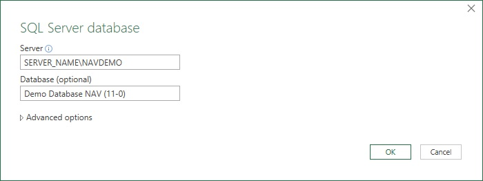
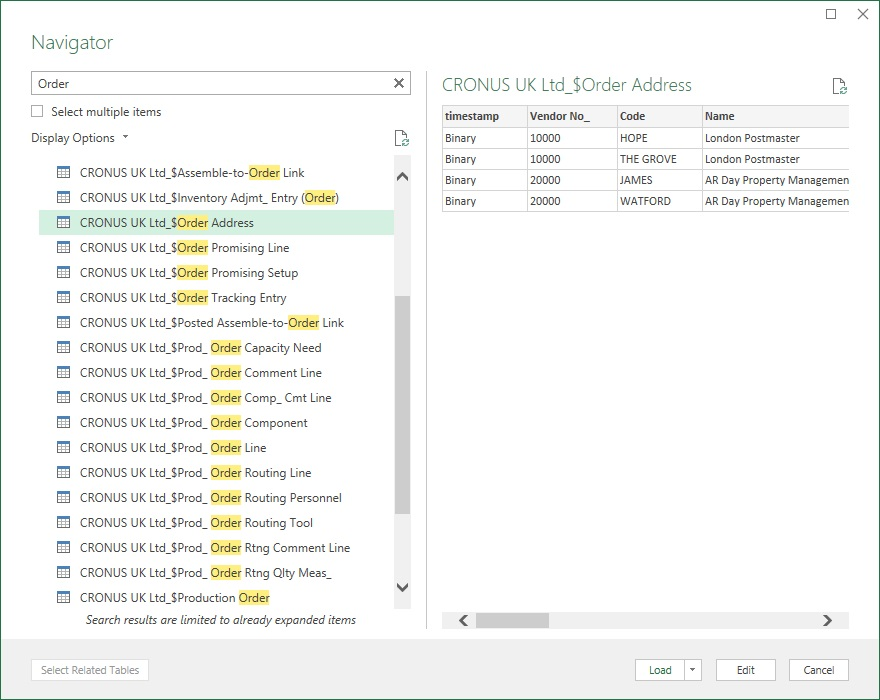
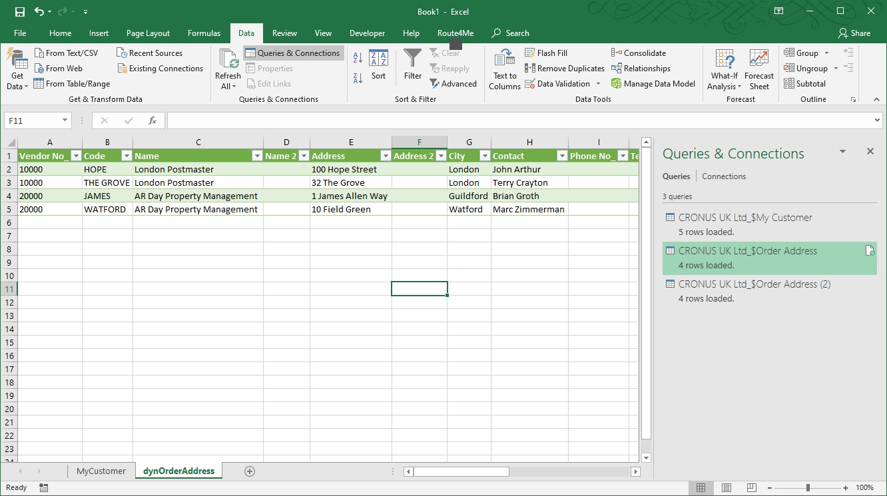

# Integreation Microsoft Dynamics in Route4Me System

There are several ways to integrate MS Dynamics in Route4Me system:

- [Consuming web-services of the MS Dynamics](#consuming-ms-dynamics-web-services);
- [Consmunig MS Dynamics Sql DB directly](#consmunig-ms-dynamics-sql-db-directly);
- Buy and install [Devart Excel Add-in for Dynamics CRM](https://www.devart.com/excel-addins/dynamics-crm.html)
- Export data from MS Dynamics to Excel and consume it by Route4MeExcelAddIn.

## Consuming MS Dynamics Web-Services 

MS Dynamics supports two type web-services ([link](https://docs.microsoft.com/en-us/dynamics-nav/web-services)):
- SOAP based Web Service;
- OData based Web Service;

In my opinion OData based service is preferable because it is supported in PowerPivot, a data-analysis add-in to Microsoft Excel that provides enhanced Business Intelligence capabilities.

The OData implementation in Microsoft Dynamics NAV 2018 also supports the JSON format.

While trying to integrate MS Dynamics in Route4me using the web-services we should know the following:
- It is currently not possible to access Microsoft Dynamics NAV “Query objects” with SOAP web services.
- It is currently not possible to access “CodeUnit Object” with OData web services.
- "Page Objects" can be accessed by both SOAP and ODATA
- OData Web Services are much Faster than SOAP.
- SOAP supports only XML format messages. OData Supports XML, JSON messages.
- SOAP for data exchange, OData for web applications.

Steps to publish OData web service in MS Dynamics Nav ([link](https://docs.microsoft.com/en-us/dynamics-nav/walkthrough-creating-and-interacting-odata-v4-bound-action)):

1. Open MS Dynamics Nav client and connect to any company (or to demo company CRONUS International Ltd with NavDemo DB at last).
2. In the Search box, enter Web services, and then choose the related link.
3. In the Web Services page, on the Home tab, choose New.
4. In the Object Type column, select Page. In the Object ID column, enter 21, and in the Service Name column, enter Customer. Select the check box in the Published column.
5. Choose the OK button.


> **Note**: MS Dynamics Nav Demo version not provides ability to publish web-services.

Some OData based services are already published in the demo version. The steps for consuming them:

- Run MS Dynamics Administrator and enable OData services:


- In the MS Dynamics search for the web services and select the service **Sales Order**:


Copy OData V4 URL value and paste it in a browser's address field. You can see returned response [here](dynamics_sales_order.json).


## Consuming MS Dynamics Sql DB Directly

Microsoft Dynamics NAV server instance is MsSql server. We can read data from sql database but writing is bad idea.

### Connect to MS Dynamics DB from Excel

You can connect to the MS Dynamics DB from Excel application:

Create empty worksheet with some name, e.g. **dynOrderAddress**.

Select the menu item in Excel: 

```Data > Get Data > From Database > From SQL Server Database```

You'll get the dialog window for connection to the server:



You will be invited to select a datatable from the database:



Click the button **Load To...**

You expect to see the dialog window:


Select the worksheet **dynOrderAddress** and click the button **OK**.

The datatable **Order Address** will be downloaded/linked to the sheet **dynOrderAddress**:



You can refresh the link manually or set the refresh interval.  

We can import exported data to Route4MeExcel work environment:
- manually;
- by VBA script;
- implementing appropriate logic in the Route4meExcel add-in project.


## Excel Add-in for Dynamics CRM

You can install Devart Excel Add-in for Dynamics CRM (it's commercial), which allows you to connect Microsoft Excel to Microsoft Dynamics CRM, quickly and easily load data from Dynamics CRM to Excel, instantly refresh data in an Excel workbook from Dynamics CRM, edit these data, and save them back to Dynamics CRM. It enables you to work with Dynamics CRM contacts, accounts, opportunities, leads, products, and other objects like with usual Excel worksheets.

Together with Route4MeExcelAddIn, this add-in enables effectively integrate MS Dynamics data in the Route4Me system.

There is another considerable Dynamics Excel add-in: [Microsoft Dynamics Office Add-in](https://appsource.microsoft.com/en-us/product/office/WA104379629?src=office&corrid=6f9547f6-4990-4c70-9b67-d9db94437cdd&omexanonuid=8dbb7a5b-1220-475c-9b48-d59f97f3f248&referralurl=). It is free but it is for MS Dynamics 365.


## Export data from MS Dynamics to Excel and consume it by Route4MeExcelAddIn

You can manually export data (e.g. sales orders) from MS Dynamics, import it in the Route4MeExcel work environment and generate routes.


## Summary

In my opinion best solutions are:
- Consuming MS Dynamics Web-Services  (OData based);
- Excel Add-in for Dynamics CRM together with Route4MeExcelAddIn.
- Connect to MS Dynamics DB from Excel.

